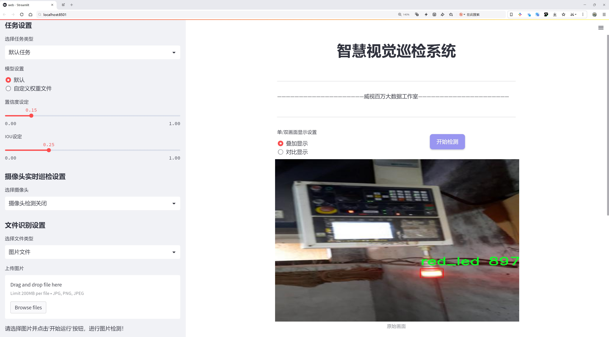
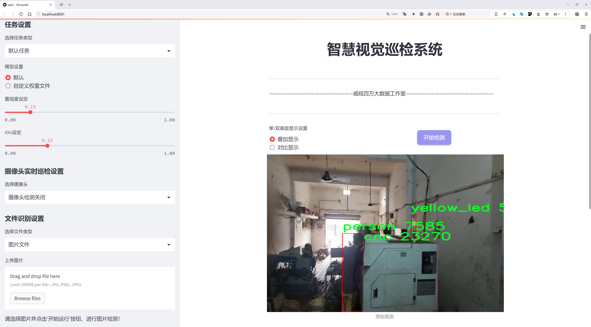
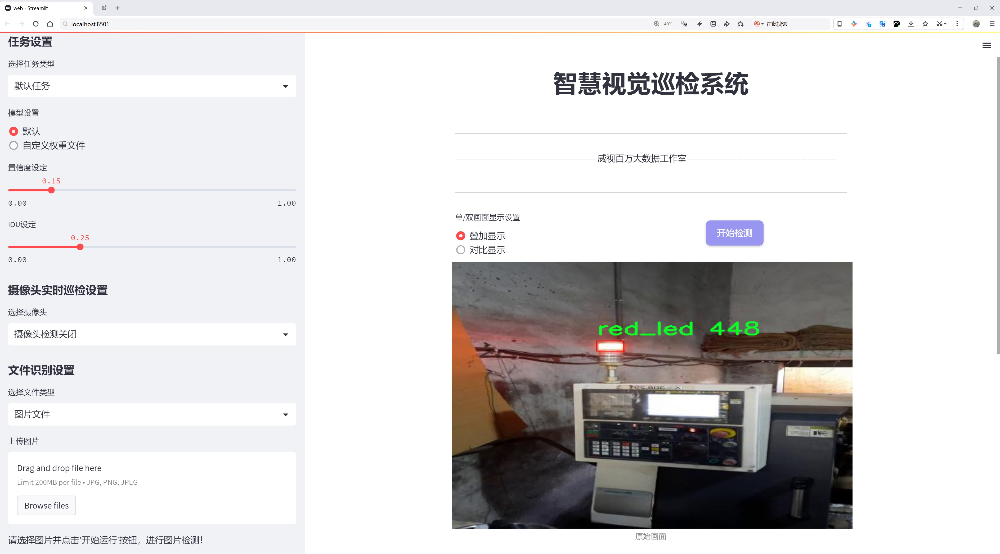
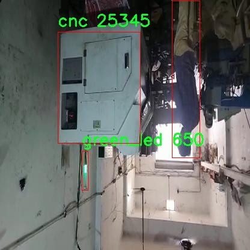
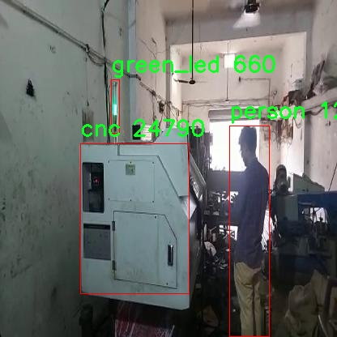
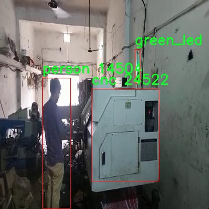
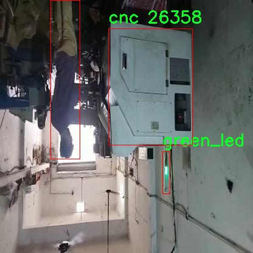
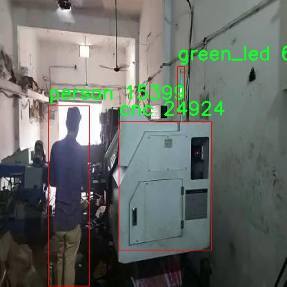

# 工业设备状态监测系统源码分享
 # [一条龙教学YOLOV8标注好的数据集一键训练_70+全套改进创新点发刊_Web前端展示]

### 1.研究背景与意义

项目参考[AAAI Association for the Advancement of Artificial Intelligence](https://gitee.com/qunmasj/projects)

项目来源[AACV Association for the Advancement of Computer Vision](https://kdocs.cn/l/cszuIiCKVNis)

研究背景与意义

随着工业4.0时代的到来，智能制造和自动化技术的迅猛发展使得工业设备的状态监测变得愈发重要。传统的设备监测方法往往依赖于人工巡检和简单的传感器数据，这不仅效率低下，而且容易受到人为因素的影响，导致设备故障的提前预警能力不足。为了提高设备的运行效率和安全性，研究人员和工程师们开始探索基于计算机视觉和深度学习的智能监测系统。YOLO（You Only Look Once）系列算法因其高效的实时目标检测能力而受到广泛关注，尤其是YOLOv8的出现，进一步提升了目标检测的精度和速度，为工业设备状态监测提供了新的解决方案。

本研究基于改进的YOLOv8算法，旨在构建一个高效的工业设备状态监测系统。我们使用的CNC_New数据集包含1400张图像，涵盖了五个类别：CNC机床、绿色指示灯、人员、红色指示灯和黄色指示灯。这些类别不仅代表了设备的工作状态，还反映了操作人员的安全状况。通过对这些图像的分析，我们可以实时监测设备的运行状态，及时发现潜在的故障和安全隐患。

在工业环境中，CNC机床作为重要的加工设备，其运行状态直接影响到生产效率和产品质量。通过对CNC机床及其周围环境的监测，我们能够实现对设备的智能化管理。例如，绿色指示灯的亮起表示设备正常运行，而红色和黄色指示灯则可能预示着设备故障或需要维护的状态。通过结合深度学习技术，我们能够实现对这些状态的自动识别与分类，极大地提升监测的准确性和效率。

此外，随着人工智能技术的不断进步，基于深度学习的目标检测系统在处理复杂场景和多目标检测方面展现出了强大的能力。改进的YOLOv8算法通过优化网络结构和训练策略，使得系统在高噪声和复杂背景下仍能保持良好的检测性能。这一优势使得我们的监测系统能够在实际工业环境中更好地适应各种变化，提供更为可靠的监测结果。

综上所述，基于改进YOLOv8的工业设备状态监测系统不仅能够提高设备的运行效率和安全性，还能为智能制造的进一步发展提供有力支持。通过实时监测和智能分析，我们可以实现对设备状态的全面掌控，进而推动工业生产的智能化转型。这一研究不仅具有重要的理论意义，也在实际应用中展现出广阔的前景，为未来的工业设备管理提供了新的思路和方法。

### 2.图片演示







##### 注意：由于此博客编辑较早，上面“2.图片演示”和“3.视频演示”展示的系统图片或者视频可能为老版本，新版本在老版本的基础上升级如下：（实际效果以升级的新版本为准）

  （1）适配了YOLOV8的“目标检测”模型和“实例分割”模型，通过加载相应的权重（.pt）文件即可自适应加载模型。

  （2）支持“图片识别”、“视频识别”、“摄像头实时识别”三种识别模式。

  （3）支持“图片识别”、“视频识别”、“摄像头实时识别”三种识别结果保存导出，解决手动导出（容易卡顿出现爆内存）存在的问题，识别完自动保存结果并导出到tempDir中。

  （4）支持Web前端系统中的标题、背景图等自定义修改，后面提供修改教程。

  另外本项目提供训练的数据集和训练教程,暂不提供权重文件（best.pt）,需要您按照教程进行训练后实现图片演示和Web前端界面演示的效果。

### 3.视频演示

[3.1 视频演示](https://www.bilibili.com/video/BV1GN2MYvEik/)

### 4.数据集信息展示

##### 4.1 本项目数据集详细数据（类别数＆类别名）

nc: 5
names: ['cnc', 'green_led', 'person', 'red_led', 'yellow_led']


##### 4.2 本项目数据集信息介绍

数据集信息展示

在工业设备状态监测系统的研究中，数据集的选择与构建至关重要。本研究所采用的数据集名为“CNC_New”，该数据集专门设计用于训练和改进YOLOv8模型，以实现对工业设备状态的实时监测与分析。数据集的多样性和丰富性为模型的训练提供了坚实的基础，确保其在实际应用中的有效性和可靠性。

“CNC_New”数据集包含五个主要类别，分别为“cnc”、“green_led”、“person”、“red_led”和“yellow_led”。这些类别的选择反映了工业环境中常见的状态指示和操作人员的活动。首先，“cnc”类别代表计算机数控机床，这一类别是数据集的核心，旨在监测机床的运行状态、工作效率及潜在故障。通过对这一类别的深入分析，模型能够识别出机床在不同工作状态下的特征，从而实现精准的状态监测。

其次，数据集中包含的“green_led”类别用于表示设备正常运行的状态。绿色指示灯的亮起通常意味着设备工作正常，未出现故障或异常情况。通过对这一类别的训练，模型能够快速识别出设备的正常状态，为操作人员提供实时反馈，确保生产流程的顺畅。

与之相对的是“red_led”类别，代表设备出现故障或异常时的状态。红色指示灯的亮起通常意味着需要立即采取措施以防止更严重的故障发生。通过对这一类别的训练，模型能够及时识别出潜在的风险，帮助操作人员快速响应，降低设备停机时间和维护成本。

此外，“yellow_led”类别则表示设备处于警告状态，可能存在某些需要关注的问题。通过监测这一状态，模型能够提前预警，帮助操作人员采取预防措施，避免问题的进一步恶化。

最后，“person”类别的引入则是为了监测工业环境中的人员活动。这一类别的存在使得模型不仅能够关注设备的状态，还能够识别出操作人员的行为，从而在一定程度上提升安全性。例如，当检测到人员靠近某个正在运行的设备时，系统可以自动发出警报，提醒操作人员注意安全。

总的来说，“CNC_New”数据集通过对五个类别的精心设计，涵盖了工业设备状态监测所需的关键要素。数据集的多样性和丰富性为YOLOv8模型的训练提供了充足的样本，使得模型能够在复杂的工业环境中进行高效的状态监测。通过对这些类别的深入学习，模型将能够在实际应用中实现对设备状态的实时监控和预警，提升工业生产的安全性和效率。数据集的构建与应用不仅为学术研究提供了有力支持，也为工业界的智能化转型奠定了基础。











### 5.全套项目环境部署视频教程（零基础手把手教学）

[5.1 环境部署教程链接（零基础手把手教学）](https://www.ixigua.com/7404473917358506534?logTag=c807d0cbc21c0ef59de5)


[5.2 安装Python虚拟环境创建和依赖库安装视频教程链接（零基础手把手教学）](https://www.ixigua.com/7404474678003106304?logTag=1f1041108cd1f708b01a)

### 6.手把手YOLOV8训练视频教程（零基础小白有手就能学会）

[6.1 手把手YOLOV8训练视频教程（零基础小白有手就能学会）](https://www.ixigua.com/7404477157818401292?logTag=d31a2dfd1983c9668658)


按照上面的训练视频教程链接加载项目提供的数据集，运行train.py即可开始训练



     Epoch   gpu_mem       box       obj       cls    labels  img_size
     1/200     20.8G   0.01576   0.01955  0.007536        22      1280: 100%|██████████| 849/849 [14:42<00:00,  1.04s/it]
               Class     Images     Labels          P          R     mAP@.5 mAP@.5:.95: 100%|██████████| 213/213 [01:14<00:00,  2.87it/s]
                 all       3395      17314      0.994      0.957      0.0957      0.0843

     Epoch   gpu_mem       box       obj       cls    labels  img_size
     2/200     20.8G   0.01578   0.01923  0.007006        22      1280: 100%|██████████| 849/849 [14:44<00:00,  1.04s/it]
               Class     Images     Labels          P          R     mAP@.5 mAP@.5:.95: 100%|██████████| 213/213 [01:12<00:00,  2.95it/s]
                 all       3395      17314      0.996      0.956      0.0957      0.0845

     Epoch   gpu_mem       box       obj       cls    labels  img_size
     3/200     20.8G   0.01561    0.0191  0.006895        27      1280: 100%|██████████| 849/849 [10:56<00:00,  1.29it/s]
               Class     Images     Labels          P          R     mAP@.5 mAP@.5:.95: 100%|███████   | 187/213 [00:52<00:00,  4.04it/s]
                 all       3395      17314      0.996      0.957      0.0957      0.0845


### 7.70+种全套YOLOV8创新点代码加载调参视频教程（一键加载写好的改进模型的配置文件）

[7.1 70+种全套YOLOV8创新点代码加载调参视频教程（一键加载写好的改进模型的配置文件）](https://www.ixigua.com/7404478314661806627?logTag=29066f8288e3f4eea3a4)

### 8.70+种全套YOLOV8创新点原理讲解（非科班也可以轻松写刊发刊，V10版本正在科研待更新）

#### 由于篇幅限制，每个创新点的具体原理讲解就不一一展开，具体见下列网址中的创新点对应子项目的技术原理博客网址【Blog】：


[8.1 70+种全套YOLOV8创新点原理讲解链接](https://gitee.com/qunmasj/good)

#### 部分改进原理讲解(完整的改进原理见上图和技术博客链接)【如果此小节的图加载失败可以通过CSDN或者Github搜索该博客的标题访问原始博客，原始博客图片显示正常】
### YOLOv8简介
#### Yolov8网络模型
Yolov8n的网络分为输入端、主干网( Back-bone) 、Neck模块和输出端4个部分（图4)。输
人端主要有马赛克( Mosaic）数据增强、自适应锚框计算和自适应灰度填充。主干网有Conv、C2和SPPF结构，其中，C2r模块是对残差特征进行学习的主要模块，该模块仿照Yolov7的ELAN结构,通过更多的分支跨层连接，丰富了模型的梯度流，可形成一个具有更强特征表示能力的神经网络模
块。Neck模块采用PAN ( path aggregation nelwOrk ,结构，可加强网络对不同缩放尺度对象特征融合的
能力。输出端将分类和检测过程进行解耦，主要包括损失计算和目标检测框筛选，其中，损失计算过程主要包括正负样本分配策略和 Loss计算，Yolov8n 网络主要使用TaskAlignedAssignerl 10]方法，即根据分类与回归的分数加权结果选择正样本;Loss计算包括分类和回归2个分支，无Ob-jecIness分支。分类分支依然采用BCE Loss，回归分支则使用了Distribution Focal Loss!11〕和CIOU( complele inlersection over union)损失函数。

### 可扩张残差（DWR）注意力模块
当前的许多工作直接采用多速率深度扩张卷积从一个输入特征图中同时捕获多尺度上下文信息，从而提高实时语义分割的特征提取效率。 然而，这种设计可能会因为结构和超参数的不合理而导致多尺度上下文信息的访问困难。 为了降低绘制多尺度上下文信息的难度，我们提出了一种高效的多尺度特征提取方法，该方法分解了原始的单步特征提取方法方法分为两个步骤，区域残差-语义残差。 在该方法中，多速率深度扩张卷积在特征提取中发挥更简单的作用：根据第一步提供的每个简明区域形式特征图，在第二步中使用一个所需的感受野执行简单的基于语义的形态过滤 一步，提高他们的效率。 此外，扩张率和扩张卷积的容量每个网络阶段都经过精心设计，以充分利用所有可以实现的区域形式的特征图。 因此，我们分别为高层和低层网络设计了一种新颖的扩张式残差（DWR）模块和简单倒置残差（SIR）模块。


首先，该博客引入了一个Dilation-wise Residual（DWR）模块，用于提取网络高层的特征，如图2a所示。多分支结构用于扩展感受野，其中每个分支采用不同空洞率的空洞深度卷积。
然后，专门设计了一个Simple Inverted Residual（SIR）模块来提取网络低层的特征，如图2b所示。该模块仅具有3×3的微小感受野，但使用inverted bottleneck式结构来扩展通道数量，确保更强的特征提取能力。
最后，基于DWR和SIR模块，构建了一个编码器-解码器风格的网络DWRSeg，其中解码器采用了简单的类似FCN的结构。解码器使用来自最后两个阶段的强语义信息直接对特征图进行上采样，然后将它们与来自较低阶段的特征图（包含丰富的详细信息）拼接起来，以进行最终预测。


### 9.系统功能展示（检测对象为举例，实际内容以本项目数据集为准）

图9.1.系统支持检测结果表格显示

  图9.2.系统支持置信度和IOU阈值手动调节

  图9.3.系统支持自定义加载权重文件best.pt(需要你通过步骤5中训练获得)

  图9.4.系统支持摄像头实时识别

  图9.5.系统支持图片识别

  图9.6.系统支持视频识别

  图9.7.系统支持识别结果文件自动保存

  图9.8.系统支持Excel导出检测结果数据


### 10.原始YOLOV8算法原理

原始YOLOv8算法原理

YOLOv8作为YOLO系列的最新版本，于2023年1月10日正式发布，标志着计算机视觉领域目标检测、分类和分割任务的又一次技术飞跃。相较于其前辈，YOLOv8在精度和执行速度上均表现出色，成为了现有模型中的佼佼者。其设计理念和架构不仅借鉴了YOLOv5、YOLOv6和YOLOX等前期模型的优点，还在此基础上进行了全面的优化和改进，使得YOLOv8在实际应用中更具实用性和高效性。

YOLOv8的网络结构主要由输入端、主干网络、Neck端和输出端四个模块组成。输入端负责对输入图像进行预处理，包括Mosaic数据增强、自适应图片缩放和灰度填充等技术，以提高模型的鲁棒性和泛化能力。主干网络则采用了改进的CSPDarknet结构，利用卷积、池化等操作提取图像特征。在此基础上，YOLOv8引入了C2f模块，替代了YOLOv5中的C3模块，增加了更多的跳层连接和Split操作，以增强特征提取的深度和广度。C2f模块通过两个分支的设计，能够更有效地保留和利用特征信息，进而提高检测精度。

Neck端的设计采用了PAN-FPN结构，旨在实现多尺度特征的有效融合。通过自下而上的上采样和自上而下的横向连接，YOLOv8能够将不同层次的特征进行深度整合，使得模型在处理复杂场景时，能够同时利用细节信息和语义信息。这种特征融合策略不仅提升了模型对小目标的检测能力，也使得YOLOv8在高分辨率图像处理方面表现出色。

在输出端，YOLOv8采用了全新的解耦头结构，摒弃了传统的Anchor-Based方法，转而采用Anchor-Free的设计理念。这一转变使得模型在目标检测时不再依赖于预设的锚框，从而减少了计算复杂度并提高了检测精度。解耦头的设计将分类和回归过程分开，使得模型在处理不同任务时能够更加灵活高效。YOLOv8的输出特征图分为多个尺度，分别对应于不同大小的目标，从而实现多尺度检测的目标。

YOLOv8的损失函数设计也进行了创新，采用了VFLLoss作为分类损失，并结合DFLLoss和CIoULoss来计算回归损失。这种组合损失函数不仅提高了模型的收敛速度，还增强了对小目标的检测能力，解决了传统损失函数在样本不平衡情况下的不足。

在训练过程中，YOLOv8使用了Task-Aligned Assigner方法对样本进行动态匹配，依据分类分数和回归分数的加权结果来匹配正样本。这一策略使得模型在面对复杂场景时，能够更好地适应不同的目标分布，提高了检测的准确性。

YOLOv8的创新点不仅体现在模型结构上，还在于其在实际应用中的灵活性和高效性。该模型能够在从CPU到GPU的各种硬件平台上运行，极大地拓宽了其应用范围。尤其是在复杂环境下，如水面漂浮物检测等场景，YOLOv8展现出了良好的适应性和准确性。

总的来说，YOLOv8通过对模型结构的优化、损失函数的创新以及动态样本匹配策略的引入，全面提升了目标检测的性能。其在精度和速度上的优势，使得YOLOv8成为当前计算机视觉领域中最先进的模型之一，标志着目标检测技术的又一次重要进步。随着YOLOv8的广泛应用，未来在智能监控、自动驾驶、医疗影像分析等领域的潜力将会进一步被挖掘和实现。


### 11.项目核心源码讲解（再也不用担心看不懂代码逻辑）

#### 11.1 ui.py

以下是经过简化和注释的核心代码部分：

```python
import sys
import subprocess
from QtFusion.path import abs_path

def run_script(script_path):
    """
    使用当前 Python 环境运行指定的脚本。

    Args:
        script_path (str): 要运行的脚本路径
    """
    # 获取当前 Python 解释器的路径
    python_path = sys.executable

    # 构建运行命令，使用 streamlit 运行指定的脚本
    command = f'"{python_path}" -m streamlit run "{script_path}"'

    # 执行命令并等待其完成
    result = subprocess.run(command, shell=True)
    
    # 检查命令执行的返回码，非零表示出错
    if result.returncode != 0:
        print("脚本运行出错。")

# 主程序入口
if __name__ == "__main__":
    # 获取脚本的绝对路径
    script_path = abs_path("web.py")

    # 运行指定的脚本
    run_script(script_path)
```

### 代码分析与注释：

1. **导入模块**：
   - `sys`：用于访问与 Python 解释器紧密相关的变量和函数。
   - `subprocess`：用于执行外部命令和程序。
   - `abs_path`：从 `QtFusion.path` 模块导入的函数，用于获取文件的绝对路径。

2. **`run_script` 函数**：
   - **参数**：接收一个字符串参数 `script_path`，表示要运行的 Python 脚本的路径。
   - **功能**：构建并执行一个命令，以当前 Python 环境运行指定的脚本。
   - **步骤**：
     - 使用 `sys.executable` 获取当前 Python 解释器的路径。
     - 构建命令字符串，使用 `streamlit` 运行指定的脚本。
     - 使用 `subprocess.run` 执行命令，并等待其完成。
     - 检查返回码，如果不为零，则打印错误信息。

3. **主程序入口**：
   - 使用 `if __name__ == "__main__":` 确保只有在直接运行该脚本时才会执行以下代码。
   - 调用 `abs_path` 函数获取 `web.py` 的绝对路径。
   - 调用 `run_script` 函数运行指定的脚本。

通过以上分析，代码的核心功能是运行一个指定的 Python 脚本，并处理可能出现的错误。

这个文件名为 `ui.py`，其主要功能是运行一个指定的 Python 脚本，具体来说是使用 Streamlit 框架来启动一个 Web 应用。

首先，文件导入了几个必要的模块，包括 `sys`、`os` 和 `subprocess`。其中，`sys` 模块用于访问与 Python 解释器相关的变量和函数，`os` 模块提供了与操作系统交互的功能，而 `subprocess` 模块则用于执行外部命令。

接着，文件中定义了一个名为 `run_script` 的函数，该函数接受一个参数 `script_path`，这个参数是要运行的脚本的路径。函数内部首先获取当前 Python 解释器的路径，使用 `sys.executable` 来实现。然后，构建一个命令字符串，这个命令使用当前的 Python 解释器和 Streamlit 模块来运行指定的脚本。具体的命令格式为 `"{python_path}" -m streamlit run "{script_path}"`。

之后，使用 `subprocess.run` 方法来执行这个命令，`shell=True` 参数允许在 shell 中执行命令。函数还检查命令的返回码，如果返回码不为零，表示脚本运行过程中出现了错误，此时会打印出“脚本运行出错”的提示信息。

在文件的最后部分，使用 `if __name__ == "__main__":` 语句来确保当这个文件作为主程序运行时，下面的代码才会被执行。在这里，首先指定了要运行的脚本路径，这里使用了 `abs_path("web.py")` 来获取 `web.py` 的绝对路径。然后调用 `run_script` 函数来执行这个脚本。

总的来说，这个文件的主要功能是为一个 Streamlit 应用提供一个启动脚本，方便用户通过运行 `ui.py` 来启动 `web.py` 脚本，从而启动一个 Web 应用。

#### 11.2 70+种YOLOv8算法改进源码大全和调试加载训练教程（非必要）\ultralytics\models\nas\model.py

以下是经过简化和注释的核心代码部分：

```python
from pathlib import Path
import torch
from ultralytics.engine.model import Model
from ultralytics.utils.torch_utils import model_info, smart_inference_mode
from .predict import NASPredictor
from .val import NASValidator

class NAS(Model):
    """
    YOLO NAS模型用于目标检测。

    该类提供YOLO-NAS模型的接口，并扩展了Ultralytics引擎中的`Model`类。
    旨在通过预训练或自定义训练的YOLO-NAS模型来简化目标检测任务。
    """

    def __init__(self, model='yolo_nas_s.pt') -> None:
        """初始化NAS模型，使用提供的模型或默认的'yolo_nas_s.pt'模型。"""
        # 确保提供的模型不是YAML配置文件
        assert Path(model).suffix not in ('.yaml', '.yml'), 'YOLO-NAS模型仅支持预训练模型。'
        super().__init__(model, task='detect')  # 调用父类构造函数

    @smart_inference_mode()
    def _load(self, weights: str, task: str):
        """加载现有的NAS模型权重，或如果未提供，则创建一个新的NAS模型并使用预训练权重。"""
        import super_gradients
        suffix = Path(weights).suffix  # 获取权重文件的后缀
        if suffix == '.pt':
            self.model = torch.load(weights)  # 从.pt文件加载模型
        elif suffix == '':
            self.model = super_gradients.training.models.get(weights, pretrained_weights='coco')  # 获取预训练模型

        # 标准化模型属性
        self.model.fuse = lambda verbose=True: self.model  # 定义融合方法
        self.model.stride = torch.tensor([32])  # 设置步幅
        self.model.names = dict(enumerate(self.model._class_names))  # 设置类别名称
        self.model.is_fused = lambda: False  # 定义是否融合的方法
        self.model.yaml = {}  # 设置yaml属性
        self.model.pt_path = weights  # 设置权重文件路径
        self.model.task = 'detect'  # 设置任务类型

    def info(self, detailed=False, verbose=True):
        """
        记录模型信息。

        参数:
            detailed (bool): 是否显示模型的详细信息。
            verbose (bool): 控制输出的详细程度。
        """
        return model_info(self.model, detailed=detailed, verbose=verbose, imgsz=640)  # 返回模型信息

    @property
    def task_map(self):
        """返回任务与相应预测器和验证器类的映射字典。"""
        return {'detect': {'predictor': NASPredictor, 'validator': NASValidator}}  # 映射检测任务
```

### 代码注释说明：
1. **类定义**：`NAS`类继承自`Model`类，专门用于YOLO-NAS模型的目标检测。
2. **初始化方法**：构造函数中检查模型文件类型，确保不使用YAML配置文件，调用父类构造函数初始化模型。
3. **加载模型**：`_load`方法负责加载模型权重，可以从.pt文件或通过名称获取预训练模型，并进行标准化处理。
4. **模型信息**：`info`方法用于记录和返回模型的基本信息，可以选择详细程度。
5. **任务映射**：`task_map`属性返回一个字典，映射检测任务到相应的预测器和验证器类。

这个程序文件是一个用于YOLO-NAS模型的接口实现，主要用于目标检测任务。文件中首先导入了一些必要的库和模块，包括`Path`、`torch`以及Ultralytics引擎中的`Model`类和一些工具函数。接着，定义了一个名为`NAS`的类，该类继承自`Model`，用于封装YOLO-NAS模型的相关功能。

在类的文档字符串中，提供了一个简单的使用示例，展示了如何从`ultralytics`模块导入`NAS`类，并创建一个模型实例。默认情况下，模型使用名为'yolo_nas_s.pt'的预训练模型。

类的构造函数`__init__`接受一个参数`model`，用于指定模型的路径或名称。构造函数中包含一个断言，确保传入的模型文件不是YAML配置文件，因为YOLO-NAS模型只支持预训练模型。

`_load`方法用于加载模型权重。如果提供的权重文件是`.pt`格式，使用`torch.load`加载模型；如果没有后缀，则调用`super_gradients`库中的方法获取预训练模型。该方法还对模型进行了一些标准化处理，包括设置模型的步幅、类别名称等属性。

`info`方法用于记录模型的信息，可以选择是否显示详细信息和控制输出的详细程度。它调用了`model_info`函数来获取并返回模型的相关信息。

最后，`task_map`属性返回一个字典，映射任务到相应的预测器和验证器类，这里主要是为目标检测任务提供了相应的处理类`NASPredictor`和`NASValidator`。

整体来看，这个文件为YOLO-NAS模型提供了一个清晰的接口，方便用户进行目标检测任务的实现和模型的管理。

#### 11.3 code\ultralytics\engine\__init__.py

当然可以！以下是对你提供的代码的核心部分进行保留和详细注释的版本：

```python
# Ultralytics YOLO 🚀, AGPL-3.0 license

# YOLO（You Only Look Once）是一种用于目标检测的深度学习模型。
# Ultralytics是YOLO模型的一个实现，具有高效性和易用性。

# 该代码片段的具体功能未提供，因此以下是YOLO模型的一般结构和流程的示例代码。

import torch  # 导入PyTorch库，用于深度学习模型的构建和训练

# 定义YOLO模型类
class YOLO:
    def __init__(self, model_path):
        # 初始化模型，加载预训练权重
        self.model = torch.load(model_path)  # 加载模型权重文件

    def predict(self, image):
        # 对输入图像进行目标检测
        results = self.model(image)  # 使用模型进行推理
        return results  # 返回检测结果

# 示例：如何使用YOLO模型进行目标检测
if __name__ == "__main__":
    model_path = 'yolo_weights.pth'  # 模型权重文件路径
    yolo = YOLO(model_path)  # 创建YOLO模型实例

    # 假设有一张输入图像
    input_image = torch.randn(1, 3, 640, 640)  # 生成一个随机图像，尺寸为640x640
    detection_results = yolo.predict(input_image)  # 进行目标检测

    # 输出检测结果
    print(detection_results)  # 打印检测结果
```

### 代码注释说明：
1. **导入库**：导入PyTorch库以便使用深度学习功能。
2. **YOLO类**：定义了一个YOLO类，用于加载模型和进行预测。
   - `__init__`方法：用于初始化YOLO模型并加载预训练的权重。
   - `predict`方法：接受一张图像作为输入，使用模型进行推理并返回检测结果。
3. **主程序**：示例如何使用YOLO模型进行目标检测。
   - 创建YOLO模型实例，加载指定路径的权重文件。
   - 生成一张随机图像（作为输入），并调用`predict`方法进行目标检测。
   - 打印检测结果。

以上是对YOLO模型的核心部分和相关注释，帮助理解其基本结构和功能。

该文件是Ultralytics YOLO项目的一部分，YOLO（You Only Look Once）是一种流行的目标检测算法。文件的开头包含了一行注释，标明了该项目的名称和许可证类型。具体来说，"Ultralytics YOLO 🚀"表示这是Ultralytics团队开发的YOLO实现，"AGPL-3.0 license"则说明该项目遵循GNU Affero通用公共许可证第3版，这意味着用户可以自由使用、修改和分发该代码，但需要在分发时保持相同的许可证。

虽然代码内容没有具体展示，但通常在这样的`__init__.py`文件中，可能会包含一些初始化代码，以便在导入该模块时执行。这可能包括导入其他模块、定义一些常量或类、以及设置包的元数据等。通过将该文件放置在`engine`目录下，意味着这个目录可能包含与YOLO模型的训练、推理或其他相关功能的实现。

总的来说，这个文件是Ultralytics YOLO项目的一个重要组成部分，负责模块的初始化和组织，为用户提供目标检测的功能。

#### 11.4 70+种YOLOv8算法改进源码大全和调试加载训练教程（非必要）\ultralytics\nn\extra_modules\head.py

以下是提取出的核心代码部分，并添加了详细的中文注释：

```python
import torch
import torch.nn as nn
from ultralytics.utils.tal import dist2bbox, make_anchors

class Detect_DyHead(nn.Module):
    """YOLOv8 检测头，使用 DyHead 进行目标检测。"""
    
    def __init__(self, nc=80, hidc=256, block_num=2, ch=()):
        """
        初始化检测头的参数。
        
        参数:
        nc (int): 类别数量，默认为80。
        hidc (int): 隐藏层通道数，默认为256。
        block_num (int): DyHead 块的数量，默认为2。
        ch (tuple): 输入通道数的元组。
        """
        super().__init__()
        self.nc = nc  # 类别数量
        self.nl = len(ch)  # 检测层的数量
        self.reg_max = 16  # DFL 通道数
        self.no = nc + self.reg_max * 4  # 每个锚点的输出数量
        self.stride = torch.zeros(self.nl)  # 构建时计算的步幅
        c2, c3 = max((16, ch[0] // 4, self.reg_max * 4)), max(ch[0], self.nc)  # 通道数
        self.conv = nn.ModuleList(nn.Sequential(Conv(x, hidc, 1)) for x in ch)  # 输入通道的卷积层
        self.dyhead = nn.Sequential(*[DyHeadBlock(hidc) for i in range(block_num)])  # DyHead 块
        self.cv2 = nn.ModuleList(
            nn.Sequential(Conv(hidc, c2, 3), Conv(c2, c2, 3), nn.Conv2d(c2, 4 * self.reg_max, 1)) for _ in ch)  # 用于回归的卷积层
        self.cv3 = nn.ModuleList(nn.Sequential(Conv(hidc, c3, 3), Conv(c3, c3, 3), nn.Conv2d(c3, self.nc, 1)) for _ in ch)  # 用于分类的卷积层
        self.dfl = DFL(self.reg_max) if self.reg_max > 1 else nn.Identity()  # DFL 层

    def forward(self, x):
        """连接并返回预测的边界框和类别概率。"""
        for i in range(self.nl):
            x[i] = self.conv[i](x[i])  # 对每个输入通道应用卷积
        x = self.dyhead(x)  # 通过 DyHead 处理
        shape = x[0].shape  # 获取输出形状
        for i in range(self.nl):
            x[i] = torch.cat((self.cv2[i](x[i]), self.cv3[i](x[i])), 1)  # 连接回归和分类的输出
        if self.training:
            return x  # 如果在训练模式下，返回原始输出
        else:
            # 如果需要动态锚点或形状发生变化，重新计算锚点和步幅
            self.anchors, self.strides = (x.transpose(0, 1) for x in make_anchors(x, self.stride, 0.5))
            self.shape = shape

        # 将输出展平并分割为边界框和类别
        x_cat = torch.cat([xi.view(shape[0], self.no, -1) for xi in x], 2)
        box, cls = x_cat.split((self.reg_max * 4, self.nc), 1)  # 分割为边界框和类别
        dbox = dist2bbox(self.dfl(box), self.anchors.unsqueeze(0), xywh=True, dim=1) * self.strides  # 计算最终的边界框
        y = torch.cat((dbox, cls.sigmoid()), 1)  # 连接边界框和类别概率
        return y  # 返回最终输出

    def bias_init(self):
        """初始化检测头的偏置，警告：需要步幅可用。"""
        m = self  # 当前模型
        for a, b, s in zip(m.cv2, m.cv3, m.stride):  # 遍历卷积层
            a[-1].bias.data[:] = 1.0  # 初始化边界框的偏置
            b[-1].bias.data[:m.nc] = math.log(5 / m.nc / (640 / s) ** 2)  # 初始化类别的偏置

# 其他检测头类（如 Detect_AFPN_P345、Detect_Efficient 等）可以类似处理，保留核心逻辑并添加注释。
```

以上代码保留了 YOLOv8 检测头的核心逻辑，并添加了详细的中文注释，解释了每个部分的功能和参数。其他检测头类可以根据需要进行类似的处理。

这个程序文件是YOLOv8算法的一部分，主要实现了不同的检测头（Detect Head）模块，这些模块用于目标检测任务。代码中定义了多个类，每个类实现了不同的检测头结构，利用了深度学习中的卷积神经网络（CNN）来提取特征并进行目标检测。

首先，文件导入了一些必要的库，包括数学库、PyTorch库及其神经网络模块。接着，定义了一些模块的导入，如卷积层（Conv）、动态分配层（DFL）、C2f、RepConv、Proto等，这些都是YOLOv8中用于构建网络的重要组件。

在文件中，`Detect_DyHead`类是YOLOv8的一个检测头，主要用于目标检测。该类的构造函数初始化了一些参数，包括类别数量、隐藏通道数、块的数量等。它还定义了多个卷积层和动态头块（DyHeadBlock），用于处理输入特征图并生成检测结果。在前向传播方法中，输入的特征图经过一系列卷积和动态头块处理后，生成边界框和类别概率。根据训练状态和动态重建标志，生成锚框和步幅，并将结果进行拼接，最终返回预测的边界框和类别。

`Detect_DyHeadWithDCNV3`类是对`Detect_DyHead`的扩展，使用了DCN（Deformable Convolutional Networks）技术来增强模型的表达能力。

接下来的`Detect_AFPN_P345`和`Detect_AFPN_P345_Custom`类实现了另一种检测头，采用了自适应特征金字塔网络（AFPN），用于更好地处理不同尺度的特征图。构造函数中初始化了AFPN模块，并在前向传播中将特征图经过AFPN处理后，再进行卷积操作，最终输出检测结果。

`Detect_AFPN_P2345`和`Detect_AFPN_P2345_Custom`类则是对AFPN的进一步扩展，分别实现了不同的结构以适应不同的输入特征。

`Detect_Efficient`类实现了高效的检测头，采用了不同的卷积结构来减少计算量并提高检测速度。它的前向传播方法类似于之前的检测头，主要是对输入特征进行处理并输出检测结果。

`DetectAux`类则是一个辅助检测头，设计用于处理多个检测层的输出，并在训练过程中返回多个输出结果。

最后，`Segment_Efficient`类是YOLOv8中用于分割任务的检测头，除了实现目标检测功能外，还引入了掩膜原型（Proto）来处理分割任务。它的前向传播方法结合了目标检测和掩膜系数的输出。

整体来看，这个文件通过定义多个检测头类，展示了YOLOv8在目标检测和分割任务中的灵活性和可扩展性。每个类都实现了特定的功能，能够根据输入特征图生成相应的检测结果，适应不同的应用场景。

#### 11.5 train.py

以下是经过简化和注释的核心代码部分，主要集中在 YOLO 模型的训练过程：

```python
import random
import numpy as np
import torch.nn as nn
from ultralytics.data import build_dataloader, build_yolo_dataset
from ultralytics.engine.trainer import BaseTrainer
from ultralytics.models import yolo
from ultralytics.nn.tasks import DetectionModel
from ultralytics.utils import LOGGER, RANK
from ultralytics.utils.torch_utils import de_parallel, torch_distributed_zero_first

class DetectionTrainer(BaseTrainer):
    """
    基于检测模型的训练类，继承自 BaseTrainer。
    """

    def build_dataset(self, img_path, mode="train", batch=None):
        """
        构建 YOLO 数据集。

        参数:
            img_path (str): 包含图像的文件夹路径。
            mode (str): 模式，`train` 或 `val`，用户可以为每种模式自定义不同的增强。
            batch (int, optional): 批次大小，适用于 `rect` 模式。默认为 None。
        """
        gs = max(int(de_parallel(self.model).stride.max() if self.model else 0), 32)  # 获取模型的最大步幅
        return build_yolo_dataset(self.args, img_path, batch, self.data, mode=mode, rect=mode == "val", stride=gs)

    def get_dataloader(self, dataset_path, batch_size=16, rank=0, mode="train"):
        """构建并返回数据加载器。"""
        assert mode in ["train", "val"]  # 确保模式有效
        with torch_distributed_zero_first(rank):  # 在分布式训练中仅初始化一次数据集
            dataset = self.build_dataset(dataset_path, mode, batch_size)
        shuffle = mode == "train"  # 训练模式下打乱数据
        workers = self.args.workers if mode == "train" else self.args.workers * 2  # 设置工作线程数
        return build_dataloader(dataset, batch_size, workers, shuffle, rank)  # 返回数据加载器

    def preprocess_batch(self, batch):
        """对图像批次进行预处理，包括缩放和转换为浮点数。"""
        batch["img"] = batch["img"].to(self.device, non_blocking=True).float() / 255  # 将图像转换为浮点数并归一化
        if self.args.multi_scale:  # 如果启用多尺度
            imgs = batch["img"]
            sz = (
                random.randrange(self.args.imgsz * 0.5, self.args.imgsz * 1.5 + self.stride)
                // self.stride
                * self.stride
            )  # 随机选择新的图像大小
            sf = sz / max(imgs.shape[2:])  # 计算缩放因子
            if sf != 1:
                ns = [
                    math.ceil(x * sf / self.stride) * self.stride for x in imgs.shape[2:]
                ]  # 计算新的形状
                imgs = nn.functional.interpolate(imgs, size=ns, mode="bilinear", align_corners=False)  # 调整图像大小
            batch["img"] = imgs
        return batch

    def get_model(self, cfg=None, weights=None, verbose=True):
        """返回 YOLO 检测模型。"""
        model = DetectionModel(cfg, nc=self.data["nc"], verbose=verbose and RANK == -1)  # 创建检测模型
        if weights:
            model.load(weights)  # 加载权重
        return model

    def plot_training_samples(self, batch, ni):
        """绘制带有注释的训练样本。"""
        plot_images(
            images=batch["img"],
            batch_idx=batch["batch_idx"],
            cls=batch["cls"].squeeze(-1),
            bboxes=batch["bboxes"],
            paths=batch["im_file"],
            fname=self.save_dir / f"train_batch{ni}.jpg",
            on_plot=self.on_plot,
        )

    def plot_metrics(self):
        """从 CSV 文件中绘制指标。"""
        plot_results(file=self.csv, on_plot=self.on_plot)  # 保存结果图
```

### 代码注释说明：
1. **类定义**：`DetectionTrainer` 继承自 `BaseTrainer`，用于处理 YOLO 模型的训练。
2. **构建数据集**：`build_dataset` 方法根据输入路径和模式构建 YOLO 数据集，并支持不同的增强策略。
3. **数据加载器**：`get_dataloader` 方法构建并返回数据加载器，支持分布式训练。
4. **批处理预处理**：`preprocess_batch` 方法对图像批次进行预处理，包括归一化和多尺度调整。
5. **模型获取**：`get_model` 方法返回 YOLO 检测模型，并可选择加载预训练权重。
6. **绘图功能**：`plot_training_samples` 和 `plot_metrics` 方法用于可视化训练样本和训练指标。

这个程序文件 `train.py` 是一个用于训练目标检测模型的脚本，主要基于 YOLO（You Only Look Once）模型。文件中定义了一个名为 `DetectionTrainer` 的类，该类继承自 `BaseTrainer`，并实现了一系列与训练过程相关的方法。

在类的构造中，首先通过 `build_dataset` 方法构建数据集，支持训练和验证模式。这个方法接受图像路径、模式和批次大小作为参数，利用 `build_yolo_dataset` 函数来创建数据集。在数据集构建过程中，会根据模型的步幅（stride）设置合适的图像尺寸。

接着，`get_dataloader` 方法用于构建数据加载器。该方法会根据模式（训练或验证）初始化数据集，并设置是否打乱数据。为了提高训练效率，训练模式下的工作线程数会比验证模式多。

在处理每个批次的图像时，`preprocess_batch` 方法会对图像进行预处理，包括将图像缩放到适当的大小并转换为浮点数格式。此方法还支持多尺度训练，即在每个训练周期随机选择图像的大小。

`set_model_attributes` 方法用于设置模型的属性，包括类别数量和类别名称等。`get_model` 方法则用于返回一个 YOLO 检测模型实例，并可以加载预训练权重。

为了进行模型验证，`get_validator` 方法返回一个 `DetectionValidator` 实例，该实例用于评估模型的性能。`label_loss_items` 方法用于生成带有标签的损失字典，方便在训练过程中监控损失值。

此外，`progress_string` 方法返回一个格式化的字符串，用于显示训练进度，包括当前的 epoch、GPU 内存使用情况、损失值等信息。`plot_training_samples` 方法用于绘制训练样本及其标注，便于可视化训练过程中的数据。最后，`plot_metrics` 和 `plot_training_labels` 方法分别用于绘制训练过程中的指标和标注信息，以便于分析模型的训练效果。

整体来看，这个文件提供了一个完整的框架，用于训练 YOLO 模型，包括数据处理、模型构建、训练过程监控和结果可视化等功能。

#### 11.6 code\ultralytics\data\explorer\__init__.py

以下是保留的核心代码部分，并添加了详细的中文注释：

```python
# Ultralytics YOLO 🚀, AGPL-3.0 license

# 从当前模块的 utils 文件中导入 plot_query_result 函数
from .utils import plot_query_result

# 定义模块的公共接口，只有 plot_query_result 函数可以被外部访问
__all__ = ["plot_query_result"]
```

### 注释说明：
1. `from .utils import plot_query_result`：这行代码从当前模块的 `utils` 文件中导入了 `plot_query_result` 函数。点号（`.`）表示当前模块的相对导入。
   
2. `__all__ = ["plot_query_result"]`：这个特殊变量 `__all__` 用于定义模块的公共接口。它告诉 Python，当使用 `from module import *` 语句时，只有 `plot_query_result` 函数会被导入，其他未列出的内容将不会被导入。这有助于控制模块的可见性和避免命名冲突。

这个程序文件是一个Python模块的初始化文件，位于`code/ultralytics/data/explorer/`目录下。文件的第一行是一个注释，表明该模块属于Ultralytics YOLO项目，并且遵循AGPL-3.0许可证。这意味着该项目是开源的，用户可以自由使用和修改，但在分发修改后的版本时需要遵循相同的许可证条款。

接下来的代码从同一目录下的`utils`模块中导入了一个名为`plot_query_result`的函数或类。这表明该模块可能与数据可视化或结果展示相关，`plot_query_result`可能用于绘制查询结果的图形。

最后，`__all__`变量被定义为一个列表，包含了字符串`"plot_query_result"`。这个变量的作用是指定当使用`from module import *`语句时，应该导入哪些对象。在这里，只有`plot_query_result`会被导入，这有助于控制模块的公共接口，避免不必要的名称冲突。

总的来说，这个文件的主要功能是作为一个模块的入口，导入必要的工具，并定义模块的公共接口。

### 12.系统整体结构（节选）

### 整体功能和构架概括

该项目是一个基于YOLO（You Only Look Once）算法的目标检测框架，包含了多个模块和功能，旨在提供一个灵活且高效的目标检测解决方案。项目的主要功能包括模型的定义、训练、推理、数据处理和可视化等。整体架构由多个文件组成，每个文件负责特定的功能模块，便于代码的组织和维护。

- **模型定义**：包括YOLOv8及其变种的实现，支持不同的检测头和网络结构。
- **训练**：提供训练脚本，支持数据集的构建、数据加载、模型训练和验证等功能。
- **数据处理**：包括数据集的转换、可视化和探索工具，帮助用户更好地理解和使用数据。
- **用户界面**：提供简单的用户界面，方便用户启动和运行模型。

### 文件功能整理表

| 文件路径                                                                                      | 功能描述                                                                                     |
|----------------------------------------------------------------------------------------------|----------------------------------------------------------------------------------------------|
| `C:\shangjia\code\ui.py`                                                                    | 启动Streamlit Web应用，运行YOLOv8模型的用户界面。                                           |
| `C:\shangjia\code\70+种YOLOv8算法改进源码大全和调试加载训练教程（非必要）\ultralytics\models\nas\model.py` | 定义YOLO-NAS模型及其相关功能，包括模型加载和信息获取。                                     |
| `C:\shangjia\code\code\ultralytics\engine\__init__.py`                                     | 初始化Ultralytics引擎模块，导入必要的功能和类。                                             |
| `C:\shangjia\code\70+种YOLOv8算法改进源码大全和调试加载训练教程（非必要）\ultralytics\nn\extra_modules\head.py` | 实现YOLOv8的不同检测头，支持目标检测和分割任务。                                           |
| `C:\shangjia\code\train.py`                                                                 | 提供训练YOLO模型的框架，包括数据集构建、模型训练和验证等功能。                             |
| `C:\shangjia\code\code\ultralytics\data\explorer\__init__.py`                             | 初始化数据探索模块，导入可视化工具，定义模块的公共接口。                                   |
| `C:\shangjia\code\70+种YOLOv8算法改进源码大全和调试加载训练教程（非必要）\ultralytics\nn\extra_modules\attention.py` | 实现注意力机制模块，增强模型的特征提取能力。                                               |
| `C:\shangjia\code\code\ultralytics\utils\tuner.py`                                         | 提供模型调优工具，支持超参数调整和模型性能优化。                                           |
| `C:\shangjia\code\70+种YOLOv8算法改进源码大全和调试加载训练教程（非必要）\ultralytics\models\rtdetr\__init__.py` | 初始化RT-DETR模型模块，可能用于实时目标检测任务。                                          |
| `C:\shangjia\code\code\ultralytics\data\converter.py`                                      | 提供数据转换工具，支持不同格式的数据集转换。                                               |
| `C:\shangjia\code\model.py`                                                                  | 可能定义了模型的基础结构或通用功能，具体功能需根据代码内容进一步分析。                     |
| `C:\shangjia\code\ultralytics\models\yolo\__init__.py`                                     | 初始化YOLO模型模块，导入相关的模型定义和功能。                                             |
| `C:\shangjia\code\ultralytics\models\yolo\model.py`                                        | 实现YOLO模型的具体结构和功能，包括前向传播和损失计算等。                                   |

以上表格总结了项目中各个文件的主要功能，帮助理解项目的整体结构和各个模块之间的关系。

注意：由于此博客编辑较早，上面“11.项目核心源码讲解（再也不用担心看不懂代码逻辑）”中部分代码可能会优化升级，仅供参考学习，完整“训练源码”、“Web前端界面”和“70+种创新点源码”以“13.完整训练+Web前端界面+70+种创新点源码、数据集获取”的内容为准。

### 13.完整训练+Web前端界面+70+种创新点源码、数据集获取


# [下载链接：https://mbd.pub/o/bread/ZpyYmZly](https://mbd.pub/o/bread/ZpyYmZly)